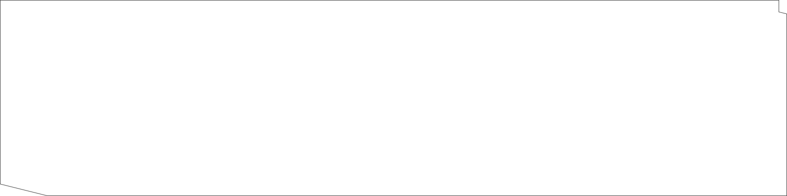
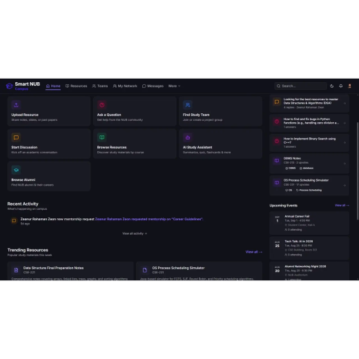
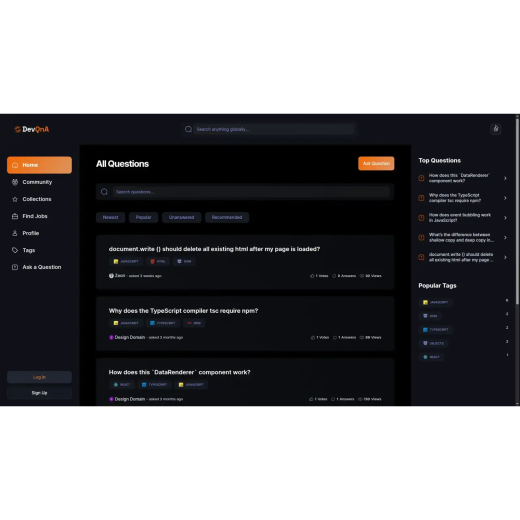
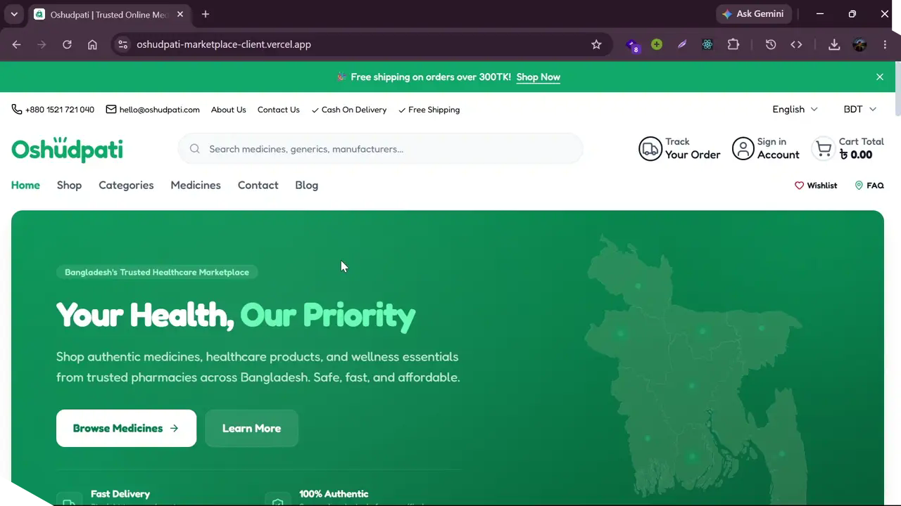
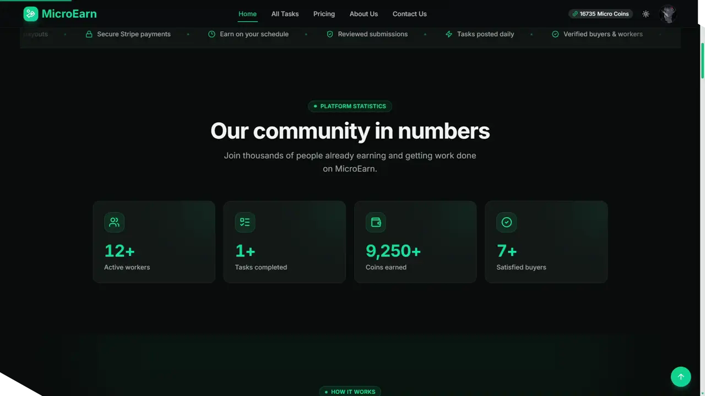

<div align="center">

<table border="0" style="width:100%">
<tr>
<td align="center" style="background:#0a090f;border:1px solid #444;border-radius:4px;padding:24px">

<p style="color:#afafaf;font-family:monospace;font-size:0.7rem;letter-spacing:0.18em">// GITHUB_PROFILE // SYSTEM_ID: ZEON // VERSION 2026</p>



<br/>

<h1 style="font-family:Tahoma,sans-serif;color:#efefe6;font-weight:700;letter-spacing:-0.02em;margin:0.4rem 0 0">
  Hi, I'm <span style="color:#f8ff31">Zeanur Rahaman Zeon</span>
</h1>

<h3 style="font-family:monospace;color:#a5a8ff;font-weight:500;letter-spacing:0.18em;margin:0.2rem 0 0;text-transform:uppercase">
  Full-Stack Software Engineer
</h3>

<p style="font-family:monospace;color:#afafaf;margin:0.4rem 0">
  I solve problems end-to-end with clean architecture &amp; solid fundamentals — tool-agnostic by principle.
</p>

<!-- status pills -->
<span style="border:1px solid #f8ff3180;background:#0a090f;color:#f8ff31;border-radius:999px;padding:4px 14px;font-family:monospace;font-size:0.75rem;display:inline-block;margin:2px">● OPEN_TO_WORK</span>
<span style="border:1px solid #444;background:#0a090f;color:#efefe6;border-radius:999px;padding:4px 14px;font-family:monospace;font-size:0.75rem;display:inline-block;margin:2px">📍 TONGI, BANGLADESH</span>
<span style="border:1px solid #444;background:#0a090f;color:#efefe6;border-radius:999px;padding:4px 14px;font-family:monospace;font-size:0.75rem;display:inline-block;margin:2px">🕑 UTC+06</span>
<span style="border:1px solid #444;background:#0a090f;color:#efefe6;border-radius:999px;padding:4px 14px;font-family:monospace;font-size:0.75rem;display:inline-block;margin:2px">🎓 CSE · NUB '27</span>

<br/><br/>

<a href="https://github.com/md-zeon"></a>
<a href="https://www.linkedin.com/in/zeanur-rahaman-zeon/"></a>
<a href="https://x.com/developer_zeon"></a>
<a href="mailto:zeon.cse@gmail.com"></a>
<a href="https://wa.me/8801521721040"></a>
<a href="https://zeanurrahamanzeon.vercel.app/"></a>

<br/>


</td>
</tr>
</table>

</div>

<br/>

## <span style="border:1px solid #444;background:#0a090f;color:#afafaf;border-radius:999px;padding:4px 14px;font-family:monospace;font-size:0.75rem;display:inline-block">// ZEON_OBJECT //</span>

```js
const zeon = {
  identity: "Zeanur Rahaman Zeon",
  role: "Full-Stack Software Engineer",
  approach: "problem-first · tool-agnostic · fundamentals over frameworks",
  basedIn: "Tongi, Gazipur, Bangladesh · UTC+06",
  education: "BSc CSE @ Northern University Bangladesh — 2027",
  buildingSince: 2023,
  languages: ["C++", "C", "JavaScript", "TypeScript", "Python", "Java"],
  core: {
    frontend: ["Next.js", "React", "Tailwind CSS", "GSAP", "Framer Motion"],
    backend: ["Node.js", "Express", "MongoDB", "PostgreSQL", "Prisma", "Socket.IO", "Firebase"],
  },
  currentlyExploring: ["motion & interaction design", "AI integrations", "real-time systems"],
  sideProjects: ["Smart NUB Campus", "DevQnA", "Oshudpati", "MicroEarn", "HistoTrack", "Parcello"],
  openTo: ["internships", "freelance", "open-source", "collaborations"],
  philosophy: "Frameworks change, fundamentals don't.",
  quote: "Don't focus on goals, focus on the system instead — James Clear (Atomic Habits)",
};
```
<br/>

## <span style="border:1px solid #444;background:#0a090f;color:#afafaf;border-radius:999px;padding:4px 14px;font-family:monospace;font-size:0.75rem;display:inline-block">// ABOUT_ME //</span>

<table align="center">
  <tr>
    <td align="left" style="background:#0a090f;border:1px solid #444;border-radius:4px;padding:16px;width:50%">
      <p style="color:#f8ff31;font-family:monospace;font-size:0.7rem;letter-spacing:0.15em;margin:0 0 6px">EDUCATION</p>
      🎓 BSc in <b style="color:#efefe6">Computer Science &amp; Engineering</b><br/>Northern University Bangladesh · Class of 2027
    </td>
    <td align="left" style="background:#0a090f;border:1px solid #444;border-radius:4px;padding:16px;width:50%">
      <p style="color:#f8ff31;font-family:monospace;font-size:0.7rem;letter-spacing:0.15em;margin:0 0 6px">THE APPROACH</p>
      🧭 I don't bind myself to one stack. I map new frameworks onto fundamentals I already know — so I'm productive in any codebase.
    </td>
  </tr>
  <tr>
    <td align="left" style="background:#0a090f;border:1px solid #444;border-radius:4px;padding:16px;width:50%">
      <p style="color:#f8ff31;font-family:monospace;font-size:0.7rem;letter-spacing:0.15em;margin:0 0 6px">WHAT I BUILD</p>
      🛠️ Real products end-to-end — data modeling, APIs, auth, and the interface users actually touch.
    </td>
    <td align="left" style="background:#0a090f;border:1px solid #444;border-radius:4px;padding:16px;width:50%">
      <p style="color:#f8ff31;font-family:monospace;font-size:0.7rem;letter-spacing:0.15em;margin:0 0 6px">NOW</p>
      📚 Deepening <b style="color:#efefe6">Next.js · TypeScript</b>, brushing up <b style="color:#efefe6">DSA</b>, and shipping open source.
    </td>
  </tr>
</table>

<br/>

> "Frameworks change, fundamentals don't. I pick the right tool for each problem — not the other way around."

<p style="text-align:right;margin:0"><span style="border:1px solid #444;background:#0a090f;color:#a5a8ff;border-radius:999px;padding:4px 14px;font-family:monospace;font-size:0.75rem;display:inline-block">// WWW.MD_ZEON.SYSTEM · OPEN SOURCE CONTRIBUTOR</span></p>

<br/>

## <span style="border:1px solid #444;background:#0a090f;color:#afafaf;border-radius:999px;padding:4px 14px;font-family:monospace;font-size:0.75rem;display:inline-block">// HOW_I_WORK //</span>

<table align="center">
  <tr>
    <td align="left" style="background:#0a090f;border:1px solid #444;border-radius:4px;padding:16px;width:33%">
      <p style="color:#f8ff31;font-family:monospace;font-size:0.7rem;letter-spacing:0.15em;margin:0 0 6px">SHIP SMALL</p>
      🔖 Small, reviewable PRs — each with a screenshot or video of what actually shipped.
    </td>
    <td align="left" style="background:#0a090f;border:1px solid #444;border-radius:4px;padding:16px;width:33%">
      <p style="color:#f8ff31;font-family:monospace;font-size:0.7rem;letter-spacing:0.15em;margin:0 0 6px">TEST WHAT MATTERS</p>
      🧪 Unit tests on the logic that matters — utilities, database layers, risky API paths.
    </td>
    <td align="left" style="background:#0a090f;border:1px solid #444;border-radius:4px;padding:16px;width:33%">
      <p style="color:#f8ff31;font-family:monospace;font-size:0.7rem;letter-spacing:0.15em;margin:0 0 6px">LEARN OUT LOUD</p>
      🗂️ I ship experiments publicly — my process and taste are visible in every repo.
    </td>
  </tr>
</table>

<br/>

## <span style="border:1px solid #444;background:#0a090f;color:#afafaf;border-radius:999px;padding:4px 14px;font-family:monospace;font-size:0.75rem;display:inline-block">// LEARNING_QUEUE //</span>

| Status | Focus |
| --- | --- |
| ✅ | **Next.js 15 · TypeScript** — App Router, Server Actions, RSC |
| 🔄 | **DSA** — daily problems in C++, building toward consistency |
| 🔄 | **AI integrations** — LLM APIs wired into real products |
| 📡 | **Real-time at scale** — Socket.IO patterns beyond chat |
| 🧰 | **Delivery** — CI/CD, testing, observability, deployment |

<br/>

## <span style="border:1px solid #444;background:#0a090f;color:#afafaf;border-radius:999px;padding:4px 14px;font-family:monospace;font-size:0.75rem;display:inline-block">// STACK_MATRIX //</span>

<table align="center">
  <tr>
    <td align="center" style="background:#0a090f;border:1px solid #444;border-radius:4px;padding:14px;width:25%">
      <p style="color:#5542ff;font-family:monospace;font-size:0.7rem;letter-spacing:0.15em;margin:0 0 8px">LANGUAGES</p>
      
      
      
      
      
      
    </td>
    <td align="center" style="background:#0a090f;border:1px solid #444;border-radius:4px;padding:14px;width:25%">
      <p style="color:#5542ff;font-family:monospace;font-size:0.7rem;letter-spacing:0.15em;margin:0 0 8px">FRONTEND</p>
      
      
      
      
      
      
    </td>
    <td align="center" style="background:#0a090f;border:1px solid #444;border-radius:4px;padding:14px;width:25%">
      <p style="color:#5542ff;font-family:monospace;font-size:0.7rem;letter-spacing:0.15em;margin:0 0 8px">BACKEND · DB</p>
      
      
      
      
      
      
      
    </td>
    <td align="center" style="background:#0a090f;border:1px solid #444;border-radius:4px;padding:14px;width:25%">
      <p style="color:#5542ff;font-family:monospace;font-size:0.7rem;letter-spacing:0.15em;margin:0 0 8px">TOOLING · CLOUD</p>
      
      
      
      
      
    </td>
  </tr>
</table>

<br/>

## <span style="border:1px solid #444;background:#0a090f;color:#afafaf;border-radius:999px;padding:4px 14px;font-family:monospace;font-size:0.75rem;display:inline-block">// FEATURED_DEPLOYMENTS //</span>

<table align="center">
  <tr>
    <td align="center" style="background:#0a090f;border:1px solid #444;border-radius:4px;padding:16px;width:50%">
      <a href="https://smart-nub-campus-client.vercel.app/"></a>
      <p style="color:#efefe6;font-family:Tahoma,sans-serif;font-weight:700;margin:10px 0 4px">Smart NUB Campus</p>
      <p style="color:#afafaf;font-family:monospace;font-size:0.7rem;margin:0 0 8px">REAL-TIME ACADEMIC NETWORK · 195+ ENDPOINTS · 48 MODELS</p>
      <p style="font-family:monospace;font-size:0.8rem;margin:0"><a href="https://smart-nub-campus-client.vercel.app/">LIVE</a> · <a href="https://github.com/md-zeon/smart-nub-campus-client">REPO</a></p>
    </td>
    <td align="center" style="background:#0a090f;border:1px solid #444;border-radius:4px;padding:16px;width:50%">
      <a href="https://dev-qna.vercel.app/"></a>
      <p style="color:#efefe6;font-family:Tahoma,sans-serif;font-weight:700;margin:10px 0 4px">DevQnA</p>
      <p style="color:#afafaf;font-family:monospace;font-size:0.7rem;margin:0 0 8px">DEVELOPER Q&A PLATFORM · 100% CUSTOM · NEXT.JS 15</p>
      <p style="font-family:monospace;font-size:0.8rem;margin:0"><a href="https://dev-qna.vercel.app/">LIVE</a> · <a href="https://github.com/md-zeon/DevQnA">REPO</a></p>
    </td>
  </tr>
  <tr>
    <td align="center" style="background:#0a090f;border:1px solid #444;border-radius:4px;padding:16px;width:50%">
      <a href="https://oshudpati-marketplace-client.vercel.app/"></a>
      <p style="color:#efefe6;font-family:Tahoma,sans-serif;font-weight:700;margin:10px 0 4px">Oshudpati Marketplace</p>
      <p style="color:#afafaf;font-family:monospace;font-size:0.7rem;margin:0 0 8px">MEDICINE MARKETPLACE · 3-ROLE RBAC · ORDER LIFECYCLE</p>
      <p style="font-family:monospace;font-size:0.8rem;margin:0"><a href="https://oshudpati-marketplace-client.vercel.app/">LIVE</a> · <a href="https://github.com/md-zeon/oshudpati-marketplace-client">REPO</a></p>
    </td>
    <td align="center" style="background:#0a090f;border:1px solid #444;border-radius:4px;padding:16px;width:50%">
      <a href="https://micro-earn-7be08.web.app/"></a>
      <p style="color:#efefe6;font-family:Tahoma,sans-serif;font-weight:700;margin:10px 0 4px">MicroEarn</p>
      <p style="color:#afafaf;font-family:monospace;font-size:0.7rem;margin:0 0 8px">MICRO-TASK MARKETPLACE · WALLETS · REWARDS · MERN</p>
      <p style="font-family:monospace;font-size:0.8rem;margin:0"><a href="https://micro-earn-7be08.web.app/">LIVE</a> · <a href="https://github.com/md-zeon/micro-earn-client">REPO</a></p>
    </td>
  </tr>
</table>

<br/>

## <span style="border:1px solid #444;background:#0a090f;color:#afafaf;border-radius:999px;padding:4px 14px;font-family:monospace;font-size:0.75rem;display:inline-block">// FROM_THE_LABS //</span>

<details>
<summary style="cursor:pointer"><span style="border:1px solid #444;background:#0a090f;color:#f8ff31;border-radius:999px;padding:4px 14px;font-family:monospace;font-size:0.75rem">▶ EXPERIMENTS · MOTION &amp; SIDE-QUESTS</span></summary>
<br/>

| Experiment | What it is | Stack |
| --- | --- | --- |
| [HistoTrack](https://github.com/md-zeon/histo-track-client) | Historical artifact tracker w/ auth & JWT | React · MongoDB · Node.js · Firebase Auth |
| [Parcello](https://github.com/md-zeon/Parcello) | Parcel management w/ real-time tracking | Full-stack · dashboard UI |
| [Shortle](https://github.com/md-zeon/shortle) | URL shortener w/ click analytics & QR codes | Full-stack |
| [Kurosumi](https://github.com/md-zeon/kurosumi) | Local-first markdown notes · dark purple theme | Web app · offline-capable |
| [QR Generator](https://github.com/md-zeon/QR-Generator) | Privacy-first styled QR generator | Next.js |
| [react-text-scramble](https://github.com/md-zeon/react-text-scramble) | Text scramble animation component | React · GSAP |
| [Brick Breaker](https://github.com/md-zeon/Brick-Breaker) | Classic game experiment | Canvas |
| [Space Shooter](https://github.com/md-zeon/space-shooter) | Arcade game experiment | HTML/CSS/JS |

</details>

<br/>

## <span style="border:1px solid #444;background:#0a090f;color:#afafaf;border-radius:999px;padding:4px 14px;font-family:monospace;font-size:0.75rem;display:inline-block">// TELEMETRY_ANALYTICS //</span>

<p align="center">
  
  
</p>

<p align="center">
  
</p>

<p align="center">
  <a href="https://github.com/ryo-ma/github-profile-trophy" target="_blank"></a>
</p>

<br/>

## <span style="border:1px solid #444;background:#0a090f;color:#afafaf;border-radius:999px;padding:4px 14px;font-family:monospace;font-size:0.75rem;display:inline-block">// CONNECT_END_POINT //</span>

<div align="center">
<p style="color:#efefe6;font-family:Tahoma,sans-serif;font-weight:600;margin:0 0 8px">Open to internships · freelance · open source</p>
<p style="font-family:monospace;font-size:0.95rem;margin:0">
  <a href="mailto:zeon.cse@gmail.com">EMAIL</a> ·
  <a href="https://wa.me/8801521721040">WHATSAPP</a> ·
  <a href="https://github.com/md-zeon">GITHUB</a> ·
  <a href="https://x.com/developer_zeon">X</a> ·
  <a href="https://www.linkedin.com/in/zeanur-rahaman-zeon/">LINKEDIN</a> ·
  <a href="https://zeanurrahamanzeon.vercel.app/">PORTFOLIO</a>
</p>
</div>

<br/>

---

<div align="center">

<p><span style="border:1px solid #444;background:#0a090f;color:#f8ff31;border-radius:999px;padding:4px 14px;font-family:monospace;font-size:0.7rem;letter-spacing:0.12em;display:inline-block">// SYSTEM_STATUS: ONLINE</span> <span style="border:1px solid #444;background:#0a090f;color:#afafaf;border-radius:999px;padding:4px 14px;font-family:monospace;font-size:0.7rem;letter-spacing:0.12em;display:inline-block">// LAST_COMMIT: ALWAYS_BUILDING</span></p>

<p><span style="border:1px solid #444;background:#0a090f;color:#a5a8ff;border-radius:999px;padding:4px 14px;font-family:monospace;font-size:0.75rem;display:inline-block">A dedicated builder who turns ideas into shipped products. 🛰️</span></p>

<a href="https://github.com/md-zeon?tab=followers"></a>
<a href="https://github.com/md-zeon"></a>

<p><span style="border:1px solid #444;background:#0a090f;color:#afafaf;border-radius:999px;padding:4px 14px;font-family:monospace;font-size:0.7rem;display:inline-block">Thanks for visiting — deploying something new soon. 😊</span></p>

</div>